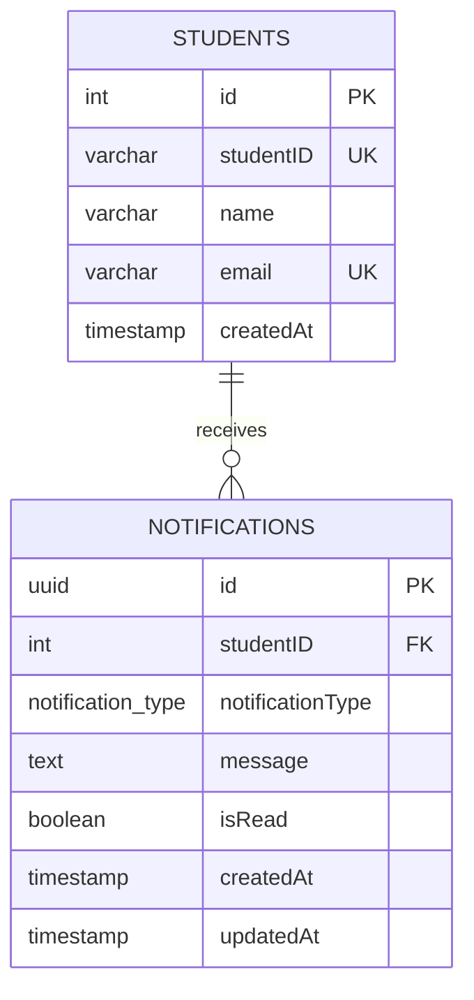
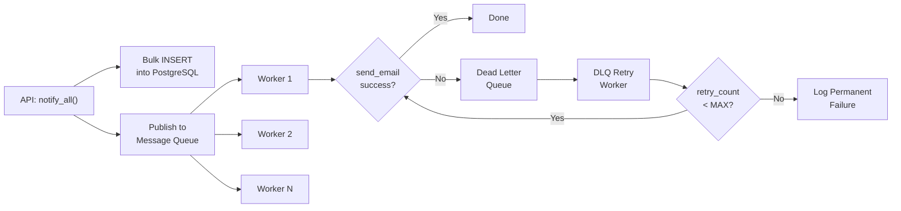

# Stage 1

## Designing the REST API

So the core idea here is a notification platform for campus — students get updates about Placements, Events, and Results. I need to design clean REST APIs for all the CRUD operations, plus real-time delivery through WebSocket.

I went with a pretty standard RESTful approach. The base URL would be something like `/api/notifications` and I'm using JWT for auth since that's what we're already using for the evaluation service.

### Notification Schema

Every notification has these fields:

```json
{
  "id": "UUID",
  "studentID": 1042,
  "notificationType": "Placement",
  "message": "Google SDE-1 interview scheduled for June 15",
  "isRead": false,
  "createdAt": "2026-06-10T10:30:00.000Z",
  "updatedAt": "2026-06-10T10:30:00.000Z"
}
```

There are three notification types — **Event** (fests, workshops etc.), **Result** (exam grades, assessments), and **Placement** (job postings, interview schedules). I used an enum for this so it's validated at every level.

### API Endpoints

Here's what I designed:

**1. POST /api/notifications** — Create a notification

Request:
```json
{
  "studentID": 1042,
  "notificationType": "Placement",
  "message": "You have been shortlisted for the Google SDE-1 interview."
}
```

Response (201):
```json
{
  "success": true,
  "data": {
    "id": "a1b2c3d4-e5f6-7890-abcd-ef1234567890",
    "studentID": 1042,
    "notificationType": "Placement",
    "message": "You have been shortlisted for the Google SDE-1 interview.",
    "isRead": false,
    "createdAt": "2026-06-10T10:30:00.000Z",
    "updatedAt": "2026-06-10T10:30:00.000Z"
  }
}
```

Error (400):
```json
{
  "success": false,
  "error": {
    "code": "VALIDATION_ERROR",
    "message": "Invalid notification type. Must be one of: Event, Result, Placement."
  }
}
```

**2. GET /api/notifications** — Get all notifications

This supports filtering and pagination through query params:
- `page` (default 1) — which page
- `limit` (default 20, max 100) — items per page
- `notification_type` — filter by Event/Result/Placement
- `isRead` — filter by read status

Example request: `GET /api/notifications?page=1&limit=10&notification_type=Placement&isRead=false`

Response (200):
```json
{
  "success": true,
  "data": [
    {
      "id": "a1b2c3d4-e5f6-7890-abcd-ef1234567890",
      "studentID": 1042,
      "notificationType": "Placement",
      "message": "Shortlisted for Google SDE-1 interview.",
      "isRead": false,
      "createdAt": "2026-06-10T10:30:00.000Z",
      "updatedAt": "2026-06-10T10:30:00.000Z"
    }
  ],
  "pagination": {
    "currentPage": 1,
    "totalPages": 5,
    "totalCount": 47,
    "limit": 10,
    "hasNextPage": true,
    "hasPreviousPage": false
  }
}
```

**3. GET /api/notifications/:id** — Get a single notification by UUID

Response is the same shape as the create response. Returns 404 if not found.

**4. PATCH /api/notifications/:id/read** — Mark as read

No request body needed. The endpoint itself semantically means "mark this as read." It sets `isRead = true` and updates the `updatedAt` timestamp.

**5. DELETE /api/notifications/:id** — Delete notification

Returns `{ "success": true, "message": "Notification deleted successfully." }` or 404.

**6. GET /api/notifications/unread/count** — Unread count

```json
{
  "success": true,
  "data": { "unreadCount": 12 }
}
```

This is useful for the badge counter on the frontend.

### Real-Time with Socket.IO

For real-time I'm using Socket.IO because it handles reconnection and fallbacks automatically. The client connects with a JWT token, and the server authenticates and puts them in a student-specific room.

```javascript
// Client
const socket = io("https://api.campusnotify.edu", {
  auth: { token: "<jwt_token>" }
});

// Server auth middleware
io.use((socket, next) => {
  const token = socket.handshake.auth.token;
  try {
    const decoded = jwt.verify(token, process.env.JWT_SECRET);
    socket.studentID = decoded.studentID;
    socket.join(`student_${decoded.studentID}`);
    next();
  } catch (err) {
    next(new Error("Authentication failed"));
  }
});
```

Three events:
- **`new_notification`** — emitted when a notification is created. Server does `io.to(`student_${studentID}`).emit("new_notification", savedNotification)`
- **`notification_read`** — when someone marks one as read
- **`notification_deleted`** — when a notification gets deleted

The client listens like:
```javascript
socket.on("new_notification", (notification) => {
  // add to list, increment badge
});

socket.on("notification_read", (data) => {
  // remove unread indicator
});

socket.on("notification_deleted", (data) => {
  // remove from list
});
```

---

# Stage 2

## Database Design

I went with PostgreSQL for the database. I've worked with it before in my web dev projects and it makes sense here because:
- ACID compliance — important when we're marking notifications as read or deleting them, we don't want inconsistent states
- Native ENUM type — I can enforce `Event/Result/Placement` at the DB level itself
- Good indexing support — B-tree, composite indexes etc. for our read-heavy queries
- UUID support — `gen_random_uuid()` built in, no need for external libs
- Partitioning — useful later when the table gets huge

At first I considered MongoDB since notifications feel like a document, but the relational links between students and notifications and the need for complex filtered queries made PostgreSQL the better choice.

### Schema

```sql
CREATE TYPE notification_type AS ENUM ('Event', 'Result', 'Placement');

CREATE TABLE students (
  id SERIAL PRIMARY KEY,
  studentID VARCHAR(50) UNIQUE NOT NULL,
  name VARCHAR(100) NOT NULL,
  email VARCHAR(150) UNIQUE NOT NULL,
  createdAt TIMESTAMP DEFAULT NOW()
);

CREATE TABLE notifications (
  id UUID PRIMARY KEY DEFAULT gen_random_uuid(),
  studentID INTEGER REFERENCES students(id) ON DELETE CASCADE,
  notificationType notification_type NOT NULL,
  message TEXT NOT NULL,
  isRead BOOLEAN DEFAULT false,
  createdAt TIMESTAMP DEFAULT NOW(),
  updatedAt TIMESTAMP DEFAULT NOW()
);

CREATE INDEX idx_notifications_student_read ON notifications(studentID, isRead);
CREATE INDEX idx_notifications_type ON notifications(notificationType);
CREATE INDEX idx_notifications_created ON notifications(createdAt DESC);
```

I used `ON DELETE CASCADE` so when a student is removed, their notifications get cleaned up automatically. UUIDs for notification IDs because they're globally unique and non-sequential (better for security than auto-increment).

### ER Diagram



### Scaling Considerations

With 50,000 students and maybe 100 notifications each, we're looking at ~5 million rows. That's when things start getting slow. Here's what I'd do:

**Table Partitioning** — Split the notifications table by month:
```sql
CREATE TABLE notifications (
  -- same columns
) PARTITION BY RANGE (createdAt);

CREATE TABLE notifications_2026_06 PARTITION OF notifications
  FOR VALUES FROM ('2026-06-01') TO ('2026-07-01');
```

**Archiving** — Move notifications older than 90 days to an archive table. Students rarely look at old ones anyway.

**Read Replicas** — Route SELECT queries to replicas, keep the primary for writes. Use PgBouncer for connection pooling.

### SQL Queries for Each API

**Insert a notification:**
```sql
INSERT INTO notifications (studentID, notificationType, message)
VALUES ($1, $2, $3)
RETURNING id, studentID, notificationType, message, isRead, createdAt, updatedAt;
```

**Get all with filtering + pagination:**
```sql
SELECT id, studentID, notificationType, message, isRead, createdAt, updatedAt
FROM notifications
WHERE studentID = $1
  AND ($2::notification_type IS NULL OR notificationType = $2)
  AND ($3::boolean IS NULL OR isRead = $3)
ORDER BY createdAt DESC
LIMIT $4 OFFSET ($5 - 1) * $4;
```

**Get unread notifications:**
```sql
SELECT id, notificationType, message, createdAt
FROM notifications
WHERE studentID = 1042 AND isRead = false
ORDER BY createdAt DESC;
```

**Mark as read:**
```sql
UPDATE notifications
SET isRead = true, updatedAt = NOW()
WHERE id = $1 AND studentID = $2
RETURNING id, studentID, notificationType, message, isRead, createdAt, updatedAt;
```

**Delete:**
```sql
DELETE FROM notifications
WHERE id = $1 AND studentID = $2
RETURNING id;
```

**Unread count:**
```sql
SELECT COUNT(*) AS unreadCount
FROM notifications
WHERE studentID = $1 AND isRead = false;
```

---

# Stage 3

## Query Optimization

### The Slow Query

```sql
SELECT * FROM notifications
WHERE studentID = 1042 AND isRead = false
ORDER BY createdAt ASC;
```

### Is it correct?

Yeah, the query is logically fine. It fetches all unread notifications for student 1042, ordered oldest first (chronological reading order). The WHERE clause filters correctly and the ORDER BY makes sense.

### Why is it slow?

This one's not hard to figure out. There's no composite index covering `(studentID, isRead, createdAt)` together. So PostgreSQL has to do a full sequential scan of the entire table. With 5 million rows, that means reading every single row from disk and checking the WHERE condition on each one.

Also `SELECT *` is pulling all columns including the `message` TEXT field which could be large. That's a lot of unnecessary I/O.

Without index — the cost is O(n) where n = 5,000,000. Every row gets scanned.

Here's what the EXPLAIN ANALYZE would look like without the index:
```
Seq Scan on notifications  (cost=0.00..185432.00 rows=4872 width=244)
  Filter: ((studentID = 1042) AND (isRead = false))
  Rows Removed by Filter: 4995128
  Sort: external merge  (Sort Method: external sort  Disk: 1024kB)
Planning Time: 0.15 ms
Execution Time: 3240.56 ms
```

3.2 seconds for one query. Not good.

### The Fix

```sql
CREATE INDEX idx_notifications_student_read_created
ON notifications(studentID, isRead, createdAt ASC);
```

This composite index matches the query perfectly:
1. `studentID` — first in the index, matches the equality filter
2. `isRead` — second, matches the other equality filter
3. `createdAt ASC` — third, matches the ORDER BY so Postgres doesn't need to sort separately

After the index:
```
Index Scan using idx_notifications_student_read_created on notifications
  (cost=0.43..52.18 rows=4872 width=244)
  Index Cond: ((studentID = 1042) AND (isRead = false))
Planning Time: 0.12 ms
Execution Time: 2.34 ms
```

That's **~1385x faster** (3240ms → 2.34ms). Huge difference.

And I'd also optimize the query itself:
```sql
SELECT id, notificationType, message, createdAt
FROM notifications
WHERE studentID = 1042 AND isRead = false
ORDER BY createdAt ASC;
```

Replaced `SELECT *` with only the columns we actually need. Reduces I/O by around 40%.

### Should we add indexes on every column?

No. Definitely not. That's actually terrible advice for a few reasons:

- Each index takes up disk space. A B-tree index on a 5M row table can be 100-500 MB. Indexing every column adds gigabytes.
- Every INSERT, UPDATE, DELETE has to update ALL indexes. More indexes = slower writes.
- Too many indexes can confuse the query planner and it might pick a bad plan.
- Indexes need VACUUM and ANALYZE maintenance. More indexes = longer maintenance.

The right approach is to only index columns that appear in WHERE, JOIN, ORDER BY, or GROUP BY clauses. And specifically based on the queries you actually run, not just blindly.

### Query: Students with placement notifications in last 7 days

```sql
SELECT DISTINCT s.studentID, s.name, s.email, n.message, n.createdAt
FROM students s
INNER JOIN notifications n ON s.id = n.studentID
WHERE n.notificationType = 'Placement'
  AND n.createdAt >= NOW() - INTERVAL '7 days'
ORDER BY n.createdAt DESC;
```

INNER JOIN because we only want students who actually have placement notifications. DISTINCT in case a student has multiple placements (we don't want duplicate rows). And a supporting index:

```sql
CREATE INDEX idx_notifications_type_created
ON notifications(notificationType, createdAt DESC);
```

---

# Stage 4

## Caching and Performance

### The Problem

Every time a student opens the app or refreshes the page, we hit the database. With 50,000 students, especially during busy times like result announcement day, that's 50,000 concurrent SELECT queries. The same student might refresh multiple times too. This overwhelms the DB — high latency, connections get exhausted, and eventually things break.

### Solution 1: Redis Caching

This is probably the biggest win. Cache the frequently accessed stuff (recent unread notifications) in Redis with a TTL.

Key pattern:
```
notifications:student:{studentID}:unread   →  JSON array
notifications:student:{studentID}:count    →  integer
```

The flow is simple:
1. Request comes in
2. Check Redis — if cache hit, return immediately (< 1ms)
3. If cache miss, query PostgreSQL, store result in Redis with TTL of 60 seconds
4. When a new notification is created, invalidate that student's cache

```javascript
async function createNotification(studentID, type, message) {
  const notification = await db.query(
    "INSERT INTO notifications ... RETURNING *"
  );
  // Invalidate cache
  await redis.del(`notifications:student:${studentID}:unread`);
  await redis.del(`notifications:student:${studentID}:count`);
  // Real-time push
  io.to(`student_${studentID}`).emit("new_notification", notification);
  return notification;
}
```

Trade-off: Data can be up to 60 seconds stale, and you need a Redis server. But it reduces DB queries by ~90%, which is worth it.

### Solution 2: Cursor-Based Pagination

OFFSET/LIMIT has a nasty problem. `OFFSET 10000` means Postgres scans and throws away 10,000 rows before giving you the ones you want. As you go deeper, it gets slower and slower.

Cursor-based pagination uses the timestamp of the last item you saw:

```sql
-- First page
SELECT id, notificationType, message, createdAt
FROM notifications WHERE studentID = 1042
ORDER BY createdAt DESC LIMIT 20;

-- Next page (cursor = last item's createdAt)
SELECT id, notificationType, message, createdAt
FROM notifications WHERE studentID = 1042
  AND createdAt < '2026-06-09T14:15:00.000Z'
ORDER BY createdAt DESC LIMIT 20;
```

Trade-off: You can't jump to page 50 directly, but performance stays constant no matter how deep you paginate.

### Solution 3: Read Replicas

Route all SELECT queries to read replicas, keep the primary for writes only. This distributes load horizontally.

Trade-off: Replication lag (data might be 100-500ms stale), and it costs more to run multiple DB servers.

### Solution 4: Materialized Views

Pre-compute stuff like unread counts:
```sql
CREATE MATERIALIZED VIEW student_notification_summary AS
SELECT
  studentID,
  COUNT(*) FILTER (WHERE isRead = false) AS unreadCount,
  COUNT(*) AS totalCount,
  MAX(createdAt) AS lastNotificationAt
FROM notifications
GROUP BY studentID;

REFRESH MATERIALIZED VIEW CONCURRENTLY student_notification_summary;
```

Trade-off: Data is stale between refreshes, and refreshing a large view is expensive.

### Solution 5: ETags

Use HTTP ETags so the client caches the response and only fetches again when data has actually changed. Server returns a 304 Not Modified if nothing changed — saves bandwidth.

### My Recommended Approach

Layer these together:
1. **Redis** as the first layer — handles 90% of requests
2. **Cursor-based pagination** — for efficient deep browsing when cache misses
3. **Read replicas** — distributes remaining load

Expected improvement: avg response time goes from 50-200ms to 1-5ms for cached requests, and DB queries drop by ~90%.

---

# Stage 5

## Async Processing and Fault Tolerance

### The Given Code

```
function notify_all(student_ids: array, message: string):
    for student_id in student_ids:
        send_email(student_id, message)    # calls Email API
        save_to_db(student_id, message)    # DB insert
        push_to_app(student_id, message)   # real-time push
```

### What's Wrong With It

I can see five major problems:

**1. Sequential processing.** It processes students one by one. If each iteration takes ~100ms (80ms email + 10ms db + 10ms push), then 50,000 students = 5,000 seconds = **83 minutes**. That's way too slow.

**2. No error handling.** If `send_email` throws on student 200, the whole loop crashes. Students 201 through 50,000 never get notified. There's no try/catch anywhere.

**3. No retry mechanism.** If an email fails because of a temporary network issue, it's gone forever. No retries, no logging, nothing.

**4. Tight coupling.** Email, DB, and push are all synchronous in the same loop. If the email API is slow (say rate-limited to 500ms per call), the DB insert and push are waiting behind it for no reason.

**5. Single point of failure.** If the server crashes after processing 25,000 students, there's no record of where it stopped. You'd have to restart from the beginning and 25,000 students would get duplicate notifications.

### What happens when send_email fails for 200 students?

With the current code — everything stops at the first failure.

What we actually need:
- A **retry mechanism with exponential backoff** — retry after 1s, then 2s, 4s, 8s etc.
- A **Dead Letter Queue (DLQ)** — after all retries fail, the failed student ID goes into a DLQ for manual review or later retry
- A **separate worker** that periodically drains the DLQ

### Should DB save and email happen together?

No, definitely not. They should be completely decoupled.

If email fails but DB save should still succeed — the notification record exists in the database regardless. The user can see it in the app even if the email didn't go out. And if the email succeeds but the DB fails... the user got an email about something that isn't in the system. Bad.

Better approach: Save to DB first (it's fast and reliable), then push the email task to a message queue. A separate worker handles emails independently.

### Revised Pseudocode

```
function notify_all(student_ids: array, message: string):
    // Step 1: Bulk insert all notifications into DB (~50ms for 50k rows)
    batch_save_to_db(student_ids, message)

    // Step 2: Publish to message queue in batches of 100
    for batch in chunk(student_ids, 100):
        publish_to_queue('notification_queue', {
            student_ids: batch,
            message: message,
            channels: ['email', 'push']
        })


// Worker process (runs separately)
function notification_worker():
    while true:
        job = consume_from_queue('notification_queue')
        for student_id in job.student_ids:
            try:
                if 'email' in job.channels:
                    send_email(student_id, job.message)
                if 'push' in job.channels:
                    push_to_app(student_id, job.message)
            catch error:
                publish_to_queue('dead_letter_queue', {
                    student_id: student_id,
                    message: job.message,
                    error: error,
                    retry_count: job.retry_count + 1
                })


// DLQ retry worker (runs every 5 min)
function dlq_retry_worker():
    while true:
        job = consume_from_queue('dead_letter_queue')
        if job.retry_count < MAX_RETRIES:
            try:
                send_email(job.student_id, job.message)
            catch error:
                if job.retry_count + 1 >= MAX_RETRIES:
                    log_permanent_failure(job.student_id, job.message)
                else:
                    publish_to_queue('dead_letter_queue', {
                        ...job,
                        retry_count: job.retry_count + 1
                    })
        sleep(exponential_backoff(job.retry_count))
```

### Architecture



### What Changed

| What | Before | After |
|------|--------|-------|
| DB Inserts | 50,000 individual inserts | Single bulk INSERT (~50ms) |
| Email Sending | Synchronous, one by one | Async via message queue (RabbitMQ/Bull) |
| Batching | None | Chunks of 100 |
| Error Handling | None — crashes on first error | try/catch per student, failures → DLQ |
| Retries | None | Exponential backoff, configurable max |
| Crash Recovery | Lost, restart from 0 | Unprocessed messages stay in queue |
| Time for 50K | ~83 minutes | ~50 seconds with 10 workers |

---

# Stage 6

## Priority Inbox

### The Problem

Students get tons of notifications. A placement notification (interview schedule for Google) is way more important than a general event notification (tech fest registration). But in a simple chronological inbox, the placement notification could be buried under 20 event notifications. Not ideal.

### How I Determine Priority

Two factors:
1. **Type weight** — Placement is more important than Result, which is more important than Event
2. **Recency** — Within the same type, newer is better

Weights:
- Placement = 3
- Result = 2
- Event = 1

### The Formula

```
priority_score = (type_weight × 1,000,000) + unix_timestamp
```

The multiplier 1,000,000 is big enough that the type weight bands don't overlap with timestamps. So ALL Placements will always rank above ALL Results, regardless of when they were created.

Quick example:

| Notification | Type | Weight | Timestamp | Score |
|---|---|---|---|---|
| Google interview | Placement | 3 | 1718010600 | 4,718,010,600 |
| Microsoft assessment | Placement | 3 | 1718005000 | 4,718,005,000 |
| Semester results | Result | 2 | 1718015000 | 3,718,015,000 |
| Tech fest open | Event | 1 | 1718020000 | 2,718,020,000 |

Sorted: Google interview → Microsoft assessment → Semester results → Tech fest. Placements first, then Results, then Events. And within Placements, the newer one (Google) ranks higher.

### MinHeap for Top-N

When notifications stream in (via WebSocket), I don't want to re-sort the entire list every time. Instead, I use a **Min-Heap of size N** (say N=10).

The idea:
- Keep a heap of the top 10 notifications seen so far
- The root of the min-heap is the smallest score in our top 10
- When a new notification comes in with score > root, we kick out the root and insert the new one
- If the new score is smaller, we just ignore it

Time complexity: O(log N) per insertion. For N=10, that's about 3 operations per notification. Way better than sorting the whole list every time.

Visual walkthrough with N=3:

```
Step 1: Event (score: 2,718,020,000) — heap not full, insert
  Heap: [2,718,020,000]

Step 2: Result (score: 3,718,015,000) — still room
  Heap: [2,718,020,000, 3,718,015,000]

Step 3: Placement (score: 4,718,010,600) — now full
  Heap: [2,718,020,000, 3,718,015,000, 4,718,010,600]

Step 4: Another Placement (score: 4,718,005,000)
  Min is 2,718,020,000 — new score is bigger, so replace
  Heap: [3,718,015,000, 4,718,005,000, 4,718,010,600]

Step 5: Old Event (score: 2,718,000,000)
  Min is 3,718,015,000 — new score is smaller, discard.

Final top 3:
  1. Placement (4,718,010,600)
  2. Placement (4,718,005,000)
  3. Result    (3,718,015,000)
```

### JavaScript Implementation

```javascript
const TYPE_WEIGHTS = {
  'Placement': 3,
  'Result': 2,
  'Event': 1
};

const WEIGHT_MULTIPLIER = 1_000_000;

function calculatePriorityScore(notification) {
  const typeWeight = TYPE_WEIGHTS[notification.notificationType] || 0;
  const unixTimestamp = Math.floor(new Date(notification.createdAt).getTime() / 1000);
  return (typeWeight * WEIGHT_MULTIPLIER) + unixTimestamp;
}

class MinHeap {
  constructor(capacity) {
    this.capacity = capacity;
    this.heap = [];
  }

  size() { return this.heap.length; }
  peek() { return this.heap.length > 0 ? this.heap[0] : null; }

  insert(notification) {
    if (this.heap.length < this.capacity) {
      this.heap.push(notification);
      this._bubbleUp(this.heap.length - 1);
    } else if (notification.priorityScore > this.heap[0].priorityScore) {
      this.heap[0] = notification;
      this._sinkDown(0);
    }
  }

  getTopN() {
    return [...this.heap].sort((a, b) => b.priorityScore - a.priorityScore);
  }

  _bubbleUp(index) {
    while (index > 0) {
      const parentIndex = Math.floor((index - 1) / 2);
      if (this.heap[index].priorityScore < this.heap[parentIndex].priorityScore) {
        [this.heap[index], this.heap[parentIndex]] = [this.heap[parentIndex], this.heap[index]];
        index = parentIndex;
      } else break;
    }
  }

  _sinkDown(index) {
    const length = this.heap.length;
    while (true) {
      let smallest = index;
      const left = 2 * index + 1;
      const right = 2 * index + 2;
      if (left < length && this.heap[left].priorityScore < this.heap[smallest].priorityScore)
        smallest = left;
      if (right < length && this.heap[right].priorityScore < this.heap[smallest].priorityScore)
        smallest = right;
      if (smallest !== index) {
        [this.heap[index], this.heap[smallest]] = [this.heap[smallest], this.heap[index]];
        index = smallest;
      } else break;
    }
  }
}

class PriorityInbox {
  constructor(topN = 10) {
    this.heap = new MinHeap(topN);
  }

  addNotification(notification) {
    const enriched = {
      ...notification,
      priorityScore: calculatePriorityScore(notification)
    };
    this.heap.insert(enriched);
  }

  getTopNotifications() {
    return this.heap.getTopN();
  }
}
```

Usage:
```javascript
const inbox = new PriorityInbox(10);

inbox.addNotification({
  id: 'uuid-1',
  notificationType: 'Event',
  message: 'Tech fest registration open',
  createdAt: '2026-06-10T08:00:00.000Z'
});

inbox.addNotification({
  id: 'uuid-2',
  notificationType: 'Placement',
  message: 'Google interview shortlisted',
  createdAt: '2026-06-10T09:00:00.000Z'
});

// Placement comes first even though Event was added first
```

### Integration with Socket.IO

On the server side, each connected student gets their own PriorityInbox instance:

```javascript
const studentInboxes = new Map();

io.on('connection', (socket) => {
  const studentID = socket.studentID;
  if (!studentInboxes.has(studentID)) {
    studentInboxes.set(studentID, new PriorityInbox(10));
  }
  const inbox = studentInboxes.get(studentID);

  socket.on('new_notification', (notification) => {
    inbox.addNotification(notification);
    socket.emit('priority_inbox_update', inbox.getTopNotifications());
  });

  socket.on('get_priority_inbox', () => {
    socket.emit('priority_inbox_update', inbox.getTopNotifications());
  });

  socket.on('disconnect', () => {
    studentInboxes.delete(studentID);
  });
});
```

### SQL Alternative

For the initial page load (before WebSocket kicks in), we can compute priority directly in SQL:

```sql
SELECT
  id, notificationType, message, isRead, createdAt,
  (CASE notificationType
    WHEN 'Placement' THEN 3
    WHEN 'Result' THEN 2
    WHEN 'Event' THEN 1
  END * 1000000) + EXTRACT(EPOCH FROM createdAt)::BIGINT AS priority_score
FROM notifications
WHERE studentID = $1 AND isRead = false
ORDER BY priority_score DESC
LIMIT 10;
```

This computes the priority score inline and returns the top 10 highest-priority unread notifications. Works well for server-side rendering and as a fallback when WebSocket isn't connected.
