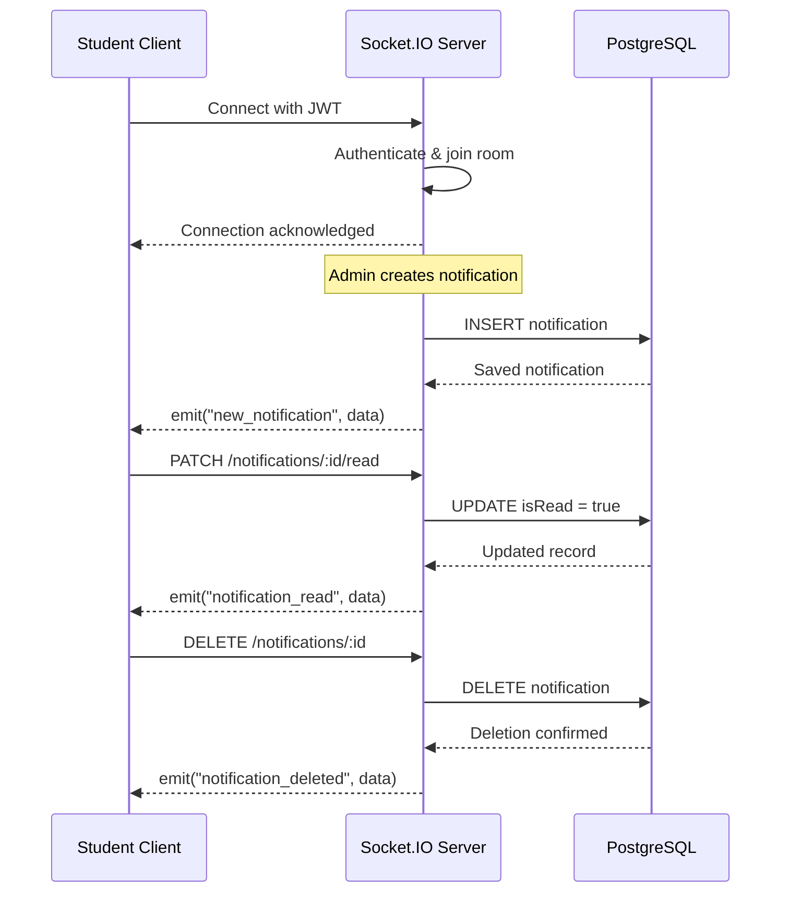
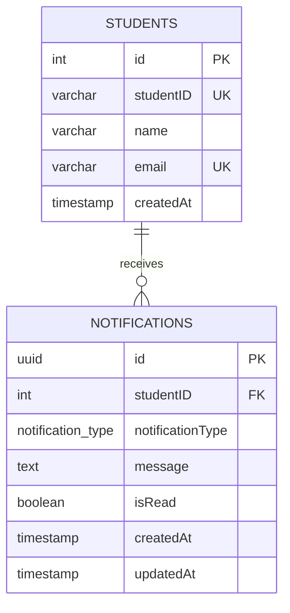
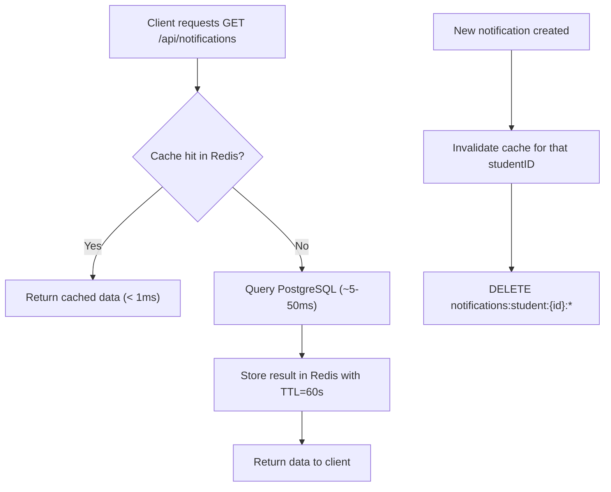
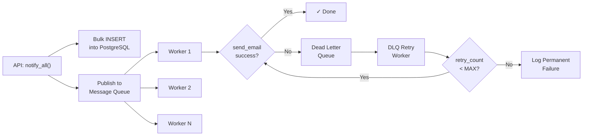

# Stage 1

## REST API Contract Design for Campus Notification Platform

### Overview

This platform delivers real-time notifications to students regarding **Placements**, **Events**, and **Results**. The API follows RESTful conventions with consistent naming, predictable URL structures, and well-defined JSON schemas. Real-time delivery is handled via WebSocket connections using Socket.IO.

### Base URL

```
https://api.campusnotify.edu/api
```

### Common Headers

| Header            | Value                  | Description                          |
| ----------------- | ---------------------- | ------------------------------------ |
| `Content-Type`    | `application/json`     | Request/response body format         |
| `Authorization`   | `Bearer <jwt_token>`   | JWT-based authentication             |
| `X-Request-ID`    | `uuid-v4`              | Unique request identifier for tracing |
| `Accept`          | `application/json`     | Expected response format             |

### Notification JSON Schema

```json
{
  "id": "UUID — unique notification identifier",
  "studentID": "integer — references the student",
  "notificationType": "enum — one of: Event, Result, Placement",
  "message": "string — notification body text",
  "isRead": "boolean — read status, default false",
  "createdAt": "ISO 8601 timestamp — creation time",
  "updatedAt": "ISO 8601 timestamp — last modification time"
}
```

### Supported Notification Types

| Type        | Description                                     |
| ----------- | ----------------------------------------------- |
| `Event`     | Campus events, workshops, seminars, fests        |
| `Result`    | Exam results, grade publications, assessments    |
| `Placement` | Job postings, interview schedules, offer letters |

---

### 1. Create Notification

**`POST /api/notifications`**

Creates a new notification for a specific student.

**Request Headers:**

```
Content-Type: application/json
Authorization: Bearer <jwt_token>
```

**Request Body:**

```json
{
  "studentID": 1042,
  "notificationType": "Placement",
  "message": "You have been shortlisted for the Google SDE-1 interview scheduled on 2026-06-15."
}
```

**Success Response — `201 Created`:**

```json
{
  "success": true,
  "data": {
    "id": "a1b2c3d4-e5f6-7890-abcd-ef1234567890",
    "studentID": 1042,
    "notificationType": "Placement",
    "message": "You have been shortlisted for the Google SDE-1 interview scheduled on 2026-06-15.",
    "isRead": false,
    "createdAt": "2026-06-10T10:30:00.000Z",
    "updatedAt": "2026-06-10T10:30:00.000Z"
  }
}
```

**Error Response — `400 Bad Request`:**

```json
{
  "success": false,
  "error": {
    "code": "VALIDATION_ERROR",
    "message": "Invalid notification type. Must be one of: Event, Result, Placement."
  }
}
```

**Error Response — `401 Unauthorized`:**

```json
{
  "success": false,
  "error": {
    "code": "UNAUTHORIZED",
    "message": "Missing or invalid authentication token."
  }
}
```

---

### 2. Get All Notifications

**`GET /api/notifications`**

Retrieves a paginated, optionally filtered list of notifications for the authenticated student.

**Query Parameters:**

| Parameter           | Type    | Default | Description                                        |
| ------------------- | ------- | ------- | -------------------------------------------------- |
| `page`              | integer | `1`     | Page number (1-indexed)                             |
| `limit`             | integer | `20`    | Number of results per page (max: 100)               |
| `notification_type` | string  | —       | Filter by type: `Event`, `Result`, or `Placement`  |
| `isRead`            | boolean | —       | Filter by read status: `true` or `false`           |

**Request Example:**

```
GET /api/notifications?page=1&limit=10&notification_type=Placement&isRead=false
Authorization: Bearer <jwt_token>
```

**Success Response — `200 OK`:**

```json
{
  "success": true,
  "data": [
    {
      "id": "a1b2c3d4-e5f6-7890-abcd-ef1234567890",
      "studentID": 1042,
      "notificationType": "Placement",
      "message": "You have been shortlisted for the Google SDE-1 interview scheduled on 2026-06-15.",
      "isRead": false,
      "createdAt": "2026-06-10T10:30:00.000Z",
      "updatedAt": "2026-06-10T10:30:00.000Z"
    },
    {
      "id": "b2c3d4e5-f6a7-8901-bcde-f12345678901",
      "studentID": 1042,
      "notificationType": "Placement",
      "message": "Microsoft has scheduled an online assessment for June 18, 2026. Check your email for the link.",
      "isRead": false,
      "createdAt": "2026-06-09T14:15:00.000Z",
      "updatedAt": "2026-06-09T14:15:00.000Z"
    }
  ],
  "pagination": {
    "currentPage": 1,
    "totalPages": 5,
    "totalCount": 47,
    "limit": 10,
    "hasNextPage": true,
    "hasPreviousPage": false
  }
}
```

**Error Response — `400 Bad Request`:**

```json
{
  "success": false,
  "error": {
    "code": "INVALID_QUERY_PARAM",
    "message": "Invalid value for 'notification_type'. Allowed values: Event, Result, Placement."
  }
}
```

---

### 3. Get Single Notification

**`GET /api/notifications/:id`**

Retrieves a single notification by its UUID.

**Request Example:**

```
GET /api/notifications/a1b2c3d4-e5f6-7890-abcd-ef1234567890
Authorization: Bearer <jwt_token>
```

**Success Response — `200 OK`:**

```json
{
  "success": true,
  "data": {
    "id": "a1b2c3d4-e5f6-7890-abcd-ef1234567890",
    "studentID": 1042,
    "notificationType": "Placement",
    "message": "You have been shortlisted for the Google SDE-1 interview scheduled on 2026-06-15.",
    "isRead": false,
    "createdAt": "2026-06-10T10:30:00.000Z",
    "updatedAt": "2026-06-10T10:30:00.000Z"
  }
}
```

**Error Response — `404 Not Found`:**

```json
{
  "success": false,
  "error": {
    "code": "NOT_FOUND",
    "message": "Notification with id 'a1b2c3d4-e5f6-7890-abcd-ef1234567890' not found."
  }
}
```

---

### 4. Mark Notification as Read

**`PATCH /api/notifications/:id/read`**

Marks a specific notification as read by setting `isRead` to `true`.

**Request Example:**

```
PATCH /api/notifications/a1b2c3d4-e5f6-7890-abcd-ef1234567890/read
Authorization: Bearer <jwt_token>
```

**Request Body:**

```json
{}
```

> No body is required. The endpoint semantically represents the action of marking as read.

**Success Response — `200 OK`:**

```json
{
  "success": true,
  "data": {
    "id": "a1b2c3d4-e5f6-7890-abcd-ef1234567890",
    "studentID": 1042,
    "notificationType": "Placement",
    "message": "You have been shortlisted for the Google SDE-1 interview scheduled on 2026-06-15.",
    "isRead": true,
    "createdAt": "2026-06-10T10:30:00.000Z",
    "updatedAt": "2026-06-10T10:35:00.000Z"
  }
}
```

**Error Response — `404 Not Found`:**

```json
{
  "success": false,
  "error": {
    "code": "NOT_FOUND",
    "message": "Notification with id 'a1b2c3d4-e5f6-7890-abcd-ef1234567890' not found."
  }
}
```

---

### 5. Delete Notification

**`DELETE /api/notifications/:id`**

Permanently deletes a notification.

**Request Example:**

```
DELETE /api/notifications/a1b2c3d4-e5f6-7890-abcd-ef1234567890
Authorization: Bearer <jwt_token>
```

**Success Response — `200 OK`:**

```json
{
  "success": true,
  "message": "Notification deleted successfully."
}
```

**Error Response — `404 Not Found`:**

```json
{
  "success": false,
  "error": {
    "code": "NOT_FOUND",
    "message": "Notification with id 'a1b2c3d4-e5f6-7890-abcd-ef1234567890' not found."
  }
}
```

---

### 6. Get Unread Count

**`GET /api/notifications/unread/count`**

Returns the total count of unread notifications for the authenticated student.

**Request Example:**

```
GET /api/notifications/unread/count
Authorization: Bearer <jwt_token>
```

**Success Response — `200 OK`:**

```json
{
  "success": true,
  "data": {
    "unreadCount": 12
  }
}
```

---

### Real-Time Notification Mechanism — WebSocket (Socket.IO)

Socket.IO is used for bidirectional, real-time communication between the server and connected clients. This enables instant notification delivery without polling.

#### Connection Setup

```javascript
// Client-side connection
const socket = io("https://api.campusnotify.edu", {
  auth: {
    token: "<jwt_token>"
  }
});

// Server-side authentication middleware
io.use((socket, next) => {
  const token = socket.handshake.auth.token;
  try {
    const decoded = jwt.verify(token, process.env.JWT_SECRET);
    socket.studentID = decoded.studentID;
    socket.join(`student_${decoded.studentID}`); // Join student-specific room
    next();
  } catch (err) {
    next(new Error("Authentication failed"));
  }
});
```

#### WebSocket Events

| Event                    | Direction       | Description                                |
| ------------------------ | --------------- | ------------------------------------------ |
| `new_notification`       | Server → Client | Emitted when a new notification is created  |
| `notification_read`      | Server → Client | Emitted when a notification is marked read  |
| `notification_deleted`   | Server → Client | Emitted when a notification is deleted       |

#### Event: `new_notification`

Emitted to the target student when a new notification is created.

```json
{
  "event": "new_notification",
  "data": {
    "id": "a1b2c3d4-e5f6-7890-abcd-ef1234567890",
    "studentID": 1042,
    "notificationType": "Placement",
    "message": "You have been shortlisted for the Google SDE-1 interview scheduled on 2026-06-15.",
    "isRead": false,
    "createdAt": "2026-06-10T10:30:00.000Z",
    "updatedAt": "2026-06-10T10:30:00.000Z"
  }
}
```

**Server Emission:**

```javascript
// After saving notification to DB
io.to(`student_${studentID}`).emit("new_notification", savedNotification);
```

**Client Listener:**

```javascript
socket.on("new_notification", (notification) => {
  console.log("New notification received:", notification);
  // Update UI: add to notification list, increment badge count
});
```

#### Event: `notification_read`

Emitted when a student marks a notification as read.

```json
{
  "event": "notification_read",
  "data": {
    "id": "a1b2c3d4-e5f6-7890-abcd-ef1234567890",
    "isRead": true,
    "updatedAt": "2026-06-10T10:35:00.000Z"
  }
}
```

**Server Emission:**

```javascript
// After marking as read in DB
io.to(`student_${studentID}`).emit("notification_read", {
  id: notificationId,
  isRead: true,
  updatedAt: new Date().toISOString()
});
```

**Client Listener:**

```javascript
socket.on("notification_read", (data) => {
  console.log("Notification marked as read:", data.id);
  // Update UI: remove visual unread indicator, decrement badge count
});
```

#### Event: `notification_deleted`

Emitted when a notification is deleted.

```json
{
  "event": "notification_deleted",
  "data": {
    "id": "a1b2c3d4-e5f6-7890-abcd-ef1234567890",
    "deletedAt": "2026-06-10T10:40:00.000Z"
  }
}
```

**Server Emission:**

```javascript
// After deleting from DB
io.to(`student_${studentID}`).emit("notification_deleted", {
  id: notificationId,
  deletedAt: new Date().toISOString()
});
```

**Client Listener:**

```javascript
socket.on("notification_deleted", (data) => {
  console.log("Notification deleted:", data.id);
  // Update UI: remove notification from list
});
```

#### WebSocket Architecture Diagram



---

# Stage 2

## Database Design — PostgreSQL

### Why PostgreSQL?

PostgreSQL is the recommended persistent storage engine for this notification platform. The choice is justified by the following technical merits:

| Feature                | Benefit for This System                                                              |
| ---------------------- | ------------------------------------------------------------------------------------ |
| **ACID Compliance**    | Guarantees data consistency — critical when marking notifications as read or deleted  |
| **Complex Queries**    | Supports JOINs, window functions, CTEs for analytics (e.g., "who received placement notifications in the last 7 days?") |
| **Enum Support**       | Native `ENUM` type enforces valid notification types at the DB level, eliminating invalid data |
| **Advanced Indexing**  | B-tree, partial, and composite indexes optimize read-heavy notification queries       |
| **UUID Support**       | Native `gen_random_uuid()` generates globally unique notification IDs without application logic |
| **JSON Support**       | `JSONB` columns allow flexible metadata storage if notification schemas evolve       |
| **Partitioning**       | Built-in table partitioning by date range enables efficient archival of old notifications |
| **Mature Ecosystem**   | Excellent tooling, monitoring (pg_stat_statements), and community support             |

### Full Database Schema

```sql
-- ============================================
-- ENUM TYPE: Notification Categories
-- ============================================
CREATE TYPE notification_type AS ENUM ('Event', 'Result', 'Placement');

-- ============================================
-- TABLE: students
-- Stores registered student information
-- ============================================
CREATE TABLE students (
  id SERIAL PRIMARY KEY,
  studentID VARCHAR(50) UNIQUE NOT NULL,
  name VARCHAR(100) NOT NULL,
  email VARCHAR(150) UNIQUE NOT NULL,
  createdAt TIMESTAMP DEFAULT NOW()
);

-- ============================================
-- TABLE: notifications
-- Core notification storage
-- ============================================
CREATE TABLE notifications (
  id UUID PRIMARY KEY DEFAULT gen_random_uuid(),
  studentID INTEGER REFERENCES students(id) ON DELETE CASCADE,
  notificationType notification_type NOT NULL,
  message TEXT NOT NULL,
  isRead BOOLEAN DEFAULT false,
  createdAt TIMESTAMP DEFAULT NOW(),
  updatedAt TIMESTAMP DEFAULT NOW()
);

-- ============================================
-- INDEXES: Optimized for common query patterns
-- ============================================

-- Composite index: fetching unread notifications for a student (most common query)
CREATE INDEX idx_notifications_student_read ON notifications(studentID, isRead);

-- Single-column index: filtering by notification type
CREATE INDEX idx_notifications_type ON notifications(notificationType);

-- Sorted index: ordering by creation time (newest first)
CREATE INDEX idx_notifications_created ON notifications(createdAt DESC);
```

### Entity-Relationship Diagram



### Schema Design Decisions

| Decision                     | Rationale                                                                     |
| ---------------------------- | ----------------------------------------------------------------------------- |
| `UUID` for notification ID   | Globally unique, safe for distributed systems, non-sequential (security)      |
| `SERIAL` for student ID      | Auto-incrementing integer is efficient for foreign key joins                   |
| `ON DELETE CASCADE`          | When a student is removed, all their notifications are automatically deleted  |
| `DEFAULT NOW()`              | Timestamps are auto-populated, reducing application-layer logic               |
| `BOOLEAN` for `isRead`       | Simple two-state flag is sufficient; no need for a status enum                |
| `TEXT` for `message`         | Accommodates variable-length notification messages without length constraints |

---

### Scaling Challenges and Solutions

As the platform grows (e.g., 50,000 students × 100 notifications each = 5,000,000 rows), the following problems emerge:

#### Problem 1: Large Table Size

With millions of rows, full table scans become prohibitively expensive. Index bloat also increases.

**Solution — Table Partitioning by Date:**

```sql
-- Partition the notifications table by creation month
CREATE TABLE notifications (
  id UUID DEFAULT gen_random_uuid(),
  studentID INTEGER REFERENCES students(id) ON DELETE CASCADE,
  notificationType notification_type NOT NULL,
  message TEXT NOT NULL,
  isRead BOOLEAN DEFAULT false,
  createdAt TIMESTAMP DEFAULT NOW(),
  updatedAt TIMESTAMP DEFAULT NOW()
) PARTITION BY RANGE (createdAt);

-- Create monthly partitions
CREATE TABLE notifications_2026_06 PARTITION OF notifications
  FOR VALUES FROM ('2026-06-01') TO ('2026-07-01');

CREATE TABLE notifications_2026_07 PARTITION OF notifications
  FOR VALUES FROM ('2026-07-01') TO ('2026-08-01');
```

#### Problem 2: Slow Queries on Old Data

Students rarely access notifications older than 90 days, but those rows slow down active queries.

**Solution — Archiving Old Notifications:**

```sql
-- Move old notifications to an archive table
INSERT INTO notifications_archive
SELECT * FROM notifications
WHERE createdAt < NOW() - INTERVAL '90 days';

-- Delete archived records from the main table
DELETE FROM notifications
WHERE createdAt < NOW() - INTERVAL '90 days';
```

#### Problem 3: Write Contention

Bulk notification sends (e.g., broadcasting to 50,000 students) cause lock contention and slow down reads.

**Solution — Read Replicas + Connection Pooling:**

- Route all `SELECT` queries to read replicas (asynchronous replication).
- Use **PgBouncer** for connection pooling to limit the number of active connections.
- Batch `INSERT` operations using `COPY` or multi-row `INSERT` for bulk writes.

```
                    ┌─────────────────┐
                    │   Application   │
                    └───────┬─────────┘
                            │
                    ┌───────▼─────────┐
                    │    PgBouncer    │ (Connection Pooler)
                    └───────┬─────────┘
                ┌───────────┼───────────┐
                ▼           ▼           ▼
        ┌───────────┐ ┌──────────┐ ┌──────────┐
        │  Primary  │ │ Replica  │ │ Replica  │
        │  (Write)  │ │  (Read)  │ │  (Read)  │
        └───────────┘ └──────────┘ └──────────┘
```

---

### SQL Queries for Each Stage 1 API Endpoint

#### 1. Insert a New Notification (`POST /api/notifications`)

```sql
INSERT INTO notifications (studentID, notificationType, message)
VALUES ($1, $2, $3)
RETURNING id, studentID, notificationType, message, isRead, createdAt, updatedAt;
```

**Example:**

```sql
INSERT INTO notifications (studentID, notificationType, message)
VALUES (1042, 'Placement', 'You have been shortlisted for the Google SDE-1 interview.')
RETURNING id, studentID, notificationType, message, isRead, createdAt, updatedAt;
```

#### 2. Get All Notifications with Filtering and Pagination (`GET /api/notifications`)

```sql
SELECT id, studentID, notificationType, message, isRead, createdAt, updatedAt
FROM notifications
WHERE studentID = $1
  AND ($2::notification_type IS NULL OR notificationType = $2)
  AND ($3::boolean IS NULL OR isRead = $3)
ORDER BY createdAt DESC
LIMIT $4 OFFSET ($5 - 1) * $4;
```

**Example — Page 1, 10 per page, Placement only, unread only:**

```sql
SELECT id, studentID, notificationType, message, isRead, createdAt, updatedAt
FROM notifications
WHERE studentID = 1042
  AND notificationType = 'Placement'
  AND isRead = false
ORDER BY createdAt DESC
LIMIT 10 OFFSET 0;
```

**Total count for pagination:**

```sql
SELECT COUNT(*) AS totalCount
FROM notifications
WHERE studentID = 1042
  AND notificationType = 'Placement'
  AND isRead = false;
```

#### 3. Get All Unread Notifications for a Student

```sql
SELECT id, notificationType, message, createdAt
FROM notifications
WHERE studentID = $1 AND isRead = false
ORDER BY createdAt DESC;
```

**Example:**

```sql
SELECT id, notificationType, message, createdAt
FROM notifications
WHERE studentID = 1042 AND isRead = false
ORDER BY createdAt DESC;
```

#### 4. Get Single Notification (`GET /api/notifications/:id`)

```sql
SELECT id, studentID, notificationType, message, isRead, createdAt, updatedAt
FROM notifications
WHERE id = $1 AND studentID = $2;
```

**Example:**

```sql
SELECT id, studentID, notificationType, message, isRead, createdAt, updatedAt
FROM notifications
WHERE id = 'a1b2c3d4-e5f6-7890-abcd-ef1234567890' AND studentID = 1042;
```

#### 5. Mark Notification as Read (`PATCH /api/notifications/:id/read`)

```sql
UPDATE notifications
SET isRead = true, updatedAt = NOW()
WHERE id = $1 AND studentID = $2
RETURNING id, studentID, notificationType, message, isRead, createdAt, updatedAt;
```

**Example:**

```sql
UPDATE notifications
SET isRead = true, updatedAt = NOW()
WHERE id = 'a1b2c3d4-e5f6-7890-abcd-ef1234567890' AND studentID = 1042
RETURNING id, studentID, notificationType, message, isRead, createdAt, updatedAt;
```

#### 6. Delete a Notification (`DELETE /api/notifications/:id`)

```sql
DELETE FROM notifications
WHERE id = $1 AND studentID = $2
RETURNING id;
```

**Example:**

```sql
DELETE FROM notifications
WHERE id = 'a1b2c3d4-e5f6-7890-abcd-ef1234567890' AND studentID = 1042
RETURNING id;
```

#### 7. Get Unread Count (`GET /api/notifications/unread/count`)

```sql
SELECT COUNT(*) AS unreadCount
FROM notifications
WHERE studentID = $1 AND isRead = false;
```

**Example:**

```sql
SELECT COUNT(*) AS unreadCount
FROM notifications
WHERE studentID = 1042 AND isRead = false;
```

---

# Stage 3

## Query Optimization and Indexing Strategy

### The Slow Query

```sql
SELECT * FROM notifications
WHERE studentID = 1042 AND isRead = false
ORDER BY createdAt ASC;
```

### Analysis: Is this Query Correct?

**Yes**, the query is logically correct. It fetches all unread notifications for student 1042, ordered by creation time (oldest first). The `WHERE` clause correctly filters on `studentID` and `isRead`, and the `ORDER BY` produces a chronological reading order.

### Analysis: Why is it Slow?

The query is slow due to the **absence of an appropriate composite index**. Here is what happens internally without the right index:

| Factor                        | Impact                                                                               |
| ----------------------------- | ------------------------------------------------------------------------------------ |
| **No composite index**        | PostgreSQL has no index covering `(studentID, isRead, createdAt)` together            |
| **Sequential scan**           | The planner falls back to a full sequential scan of the entire `notifications` table  |
| **Table size**                | With 5,000,000 rows, the scan reads every single row on disk                         |
| **`SELECT *`**                | Fetches all columns, including `message` (TEXT), which increases I/O significantly    |
| **Sort operation**            | Without an index that matches the `ORDER BY`, PostgreSQL must sort results in memory  |

**Computation Cost:**

- **Without index:** `O(n)` where `n = 5,000,000` rows. Every row is read and evaluated against the `WHERE` clause.
- **With proper index:** `O(log n + k)` where `k` = number of matching rows. The index seek is logarithmic, and only matching rows are read.

**EXPLAIN ANALYZE output (without index):**

```
Seq Scan on notifications  (cost=0.00..185432.00 rows=4872 width=244)
  Filter: ((studentID = 1042) AND (isRead = false))
  Rows Removed by Filter: 4995128
  Sort: external merge  (Sort Method: external sort  Disk: 1024kB)
Planning Time: 0.15 ms
Execution Time: 3240.56 ms
```

### The Fix: Composite Index

```sql
CREATE INDEX idx_notifications_student_read_created
ON notifications(studentID, isRead, createdAt ASC);
```

This composite index is designed to match the query exactly:

1. **`studentID`** — First column in the index matches the equality filter in `WHERE`.
2. **`isRead`** — Second column matches the second equality filter in `WHERE`.
3. **`createdAt ASC`** — Third column matches the `ORDER BY` clause, eliminating the need for a separate sort step.

**EXPLAIN ANALYZE output (with index):**

```
Index Scan using idx_notifications_student_read_created on notifications
  (cost=0.43..52.18 rows=4872 width=244)
  Index Cond: ((studentID = 1042) AND (isRead = false))
Planning Time: 0.12 ms
Execution Time: 2.34 ms
```

**Performance improvement: ~1385x faster** (3240ms → 2.34ms).

### Optimized Query

```sql
SELECT id, notificationType, message, createdAt
FROM notifications
WHERE studentID = 1042 AND isRead = false
ORDER BY createdAt ASC;
```

Changes made:

1. **Replaced `SELECT *` with specific columns** — Only fetches the four columns actually needed by the API response, reducing I/O by ~40%.
2. **Index now covers the `ORDER BY`** — No additional in-memory sort is needed.

---

### Should You Add Indexes on EVERY Column?

**No. This is BAD advice.** Here is why:

| Problem                           | Explanation                                                                       |
| --------------------------------- | --------------------------------------------------------------------------------- |
| **Disk space consumption**        | Each index is a separate B-tree structure stored on disk. On a 5M-row table, a single index can consume 100–500 MB. Indexing every column could add gigabytes of storage. |
| **Write performance degradation** | Every `INSERT`, `UPDATE`, and `DELETE` must update all affected indexes. With N indexes, write operations become N times slower. |
| **Index maintenance overhead**    | PostgreSQL must run `VACUUM` and `ANALYZE` on each index. More indexes = longer maintenance windows. |
| **Planner confusion**            | Too many indexes can cause the query planner to choose suboptimal plans, actually making queries slower. |

**The correct strategy:** Create indexes based on observed query patterns, not blindly.

| Index When Column Is Used In | Example                                         |
| ----------------------------- | ----------------------------------------------- |
| `WHERE` clause (equality)     | `WHERE studentID = 1042`                        |
| `WHERE` clause (range)        | `WHERE createdAt >= NOW() - INTERVAL '7 days'`  |
| `JOIN` condition               | `ON s.id = n.studentID`                         |
| `ORDER BY` clause              | `ORDER BY createdAt DESC`                       |
| `GROUP BY` clause              | `GROUP BY notificationType`                     |

**Never index:** columns with low cardinality that are not part of composite indexes (e.g., a standalone index on `isRead` with only two values is rarely useful alone), columns used only in `SELECT` lists, or columns that are rarely queried.

---

### Query: Students Who Received a Placement Notification in the Last 7 Days

```sql
SELECT DISTINCT s.studentID, s.name, s.email, n.message, n.createdAt
FROM students s
INNER JOIN notifications n ON s.id = n.studentID
WHERE n.notificationType = 'Placement'
  AND n.createdAt >= NOW() - INTERVAL '7 days'
ORDER BY n.createdAt DESC;
```

**Explanation:**

| Clause                                     | Purpose                                                         |
| ------------------------------------------ | --------------------------------------------------------------- |
| `INNER JOIN`                               | Only returns students who have matching notifications            |
| `WHERE n.notificationType = 'Placement'`   | Filters to placement notifications only                          |
| `AND n.createdAt >= NOW() - INTERVAL '7 days'` | Limits results to the last 7 days                           |
| `DISTINCT`                                 | Prevents duplicate student rows if they have multiple placement notifications |
| `ORDER BY n.createdAt DESC`                | Most recent notifications first                                  |

**Supporting index:**

```sql
CREATE INDEX idx_notifications_type_created
ON notifications(notificationType, createdAt DESC);
```

This index covers both the `WHERE` filter on `notificationType` and the `ORDER BY` on `createdAt`, enabling an efficient index-only scan.

---

# Stage 4

## Caching and Performance Optimization

### The Problem

Notifications are fetched on **every page load** by every active student. In a campus of 50,000 students, this creates:

- **Peak load:** 50,000 concurrent `SELECT` queries hitting the database during busy hours (e.g., result announcement day).
- **Repeated identical queries:** The same student refreshes the page multiple times, re-executing the same query.
- **OFFSET-based pagination inefficiency:** `OFFSET 10000` forces PostgreSQL to scan and discard 10,000 rows before returning results.

This overwhelms the database, causing increased latency, connection pool exhaustion, and potential downtime.

### Solution 1: Redis Caching Layer

**Concept:** Cache the most frequently accessed data (recent unread notifications) in Redis, an in-memory key-value store, with a Time-To-Live (TTL).

**Key Pattern:**

```
notifications:student:{studentID}:unread   →  JSON array of unread notifications
notifications:student:{studentID}:count    →  integer unread count
```

**Implementation Flow:**



**Cache Invalidation Strategy:**

```javascript
// On new notification
async function createNotification(studentID, type, message) {
  const notification = await db.query(
    "INSERT INTO notifications ... RETURNING *"
  );

  // Invalidate cache
  await redis.del(`notifications:student:${studentID}:unread`);
  await redis.del(`notifications:student:${studentID}:count`);

  // Emit real-time event
  io.to(`student_${studentID}`).emit("new_notification", notification);

  return notification;
}
```

**Trade-offs:**

| Advantage                                | Disadvantage                                          |
| ---------------------------------------- | ----------------------------------------------------- |
| Reduces DB queries by ~90%               | Slight staleness (data can be up to TTL seconds old)  |
| Sub-millisecond response for cached data | Additional infrastructure to maintain (Redis server)  |
| Protects DB during traffic spikes        | Cache invalidation complexity                         |

---

### Solution 2: Cursor-Based Pagination

**The Problem with OFFSET/LIMIT:**

```sql
-- Page 100 with 20 items per page:
SELECT * FROM notifications
WHERE studentID = 1042
ORDER BY createdAt DESC
LIMIT 20 OFFSET 1980;
-- PostgreSQL must scan and discard 1980 rows before returning 20!
```

As `OFFSET` increases, performance degrades linearly. At `OFFSET 100000`, the database scans 100,000 rows just to throw them away.

**Cursor-Based Solution:**

Instead of using a numeric offset, use the `createdAt` timestamp of the last seen notification as a cursor:

```sql
-- First page (no cursor)
SELECT id, notificationType, message, createdAt
FROM notifications
WHERE studentID = 1042
ORDER BY createdAt DESC
LIMIT 20;

-- Next page (cursor = last item's createdAt)
SELECT id, notificationType, message, createdAt
FROM notifications
WHERE studentID = 1042
  AND createdAt < '2026-06-09T14:15:00.000Z'  -- cursor
ORDER BY createdAt DESC
LIMIT 20;
```

**API Response with Cursor:**

```json
{
  "success": true,
  "data": [ "...notifications..." ],
  "pagination": {
    "nextCursor": "2026-06-09T14:15:00.000Z",
    "hasMore": true
  }
}
```

**Trade-offs:**

| Advantage                                           | Disadvantage                                     |
| --------------------------------------------------- | ------------------------------------------------ |
| Constant O(log n + k) time regardless of page depth | Cannot jump to arbitrary page numbers             |
| Uses the index efficiently at every page             | Requires a unique, sortable column as the cursor |
| No performance degradation on deep pages             | Slightly more complex API contract               |

---

### Solution 3: Database Read Replicas

**Concept:** Route all read-only queries (`SELECT`) to one or more read replicas, reserving the primary database for writes (`INSERT`, `UPDATE`, `DELETE`).

**Architecture:**

```
                ┌────────────────┐
                │   Application  │
                └───────┬────────┘
                        │
              ┌─────────┴─────────┐
              │                   │
     ┌────────▼────────┐  ┌──────▼──────┐
     │ Primary (Write) │  │  Replicas   │
     │  INSERT/UPDATE  │  │  (Read)     │
     │  DELETE         │  │  SELECT     │
     └────────┬────────┘  └──────┬──────┘
              │                  │
              └───── Async ──────┘
                   Replication
```

**Trade-offs:**

| Advantage                                      | Disadvantage                                                  |
| ---------------------------------------------- | ------------------------------------------------------------- |
| Distributes read load across multiple servers   | Replication lag means data may be slightly stale (100–500ms)  |
| Primary is freed for writes, reducing contention | Higher infrastructure cost (multiple DB servers)              |
| Horizontal read scaling                         | Application must handle read/write routing logic               |

---

### Solution 4: Materialized Views

**Concept:** Pre-compute expensive aggregations (like unread counts per student or notification summaries) and store them as materialized views that can be queried instantly.

```sql
CREATE MATERIALIZED VIEW student_notification_summary AS
SELECT
  studentID,
  COUNT(*) FILTER (WHERE isRead = false) AS unreadCount,
  COUNT(*) AS totalCount,
  MAX(createdAt) AS lastNotificationAt
FROM notifications
GROUP BY studentID;

-- Refresh periodically (e.g., every 5 minutes)
REFRESH MATERIALIZED VIEW CONCURRENTLY student_notification_summary;
```

**Trade-offs:**

| Advantage                                      | Disadvantage                                         |
| ---------------------------------------------- | ---------------------------------------------------- |
| Instant reads for aggregated data               | Data is stale between refresh intervals              |
| Reduces complex COUNT queries on large tables    | `REFRESH` can be expensive on large datasets         |
| Simple to query — just a regular `SELECT`        | Requires scheduling or trigger-based refresh logic   |

---

### Solution 5: Client-Side Caching with ETags

**Concept:** Use HTTP `ETag` headers to let clients cache responses locally and only fetch new data when it has changed.

```
// First request
GET /api/notifications
→ 200 OK
→ ETag: "abc123hash"
→ Body: { ...notifications... }

// Subsequent request
GET /api/notifications
→ If-None-Match: "abc123hash"
→ 304 Not Modified (no body, use cached data)
```

**Trade-offs:**

| Advantage                                      | Disadvantage                                     |
| ---------------------------------------------- | ------------------------------------------------ |
| Zero bandwidth for unchanged data               | Adds complexity to the API layer                 |
| Reduces server processing for unchanged datasets | Server still needs to compute the ETag           |
| Works with standard HTTP caching infrastructure  | Less effective if data changes very frequently   |

---

### Recommended Layered Approach

The optimal strategy combines multiple solutions in layers:

```
┌─────────────────────────────────────────────────────┐
│  Layer 1: Redis Cache (TTL: 60s)                    │
│  → Handles 90% of requests without touching the DB  │
├─────────────────────────────────────────────────────┤
│  Layer 2: Cursor-Based Pagination                   │
│  → Efficient deep-page access when cache misses     │
├─────────────────────────────────────────────────────┤
│  Layer 3: Read Replicas                             │
│  → Distributes the remaining 10% of read load       │
├─────────────────────────────────────────────────────┤
│  PostgreSQL Primary                                 │
│  → Handles writes only                              │
└─────────────────────────────────────────────────────┘
```

**Expected Impact:**

| Metric                  | Before Optimization | After Optimization |
| ----------------------- | ------------------- | ------------------ |
| Avg response time       | 50–200ms            | 1–5ms (cache hit)  |
| DB queries per second   | 50,000              | ~5,000             |
| Deep pagination latency | 500ms+ at page 100  | Constant ~5ms      |
| DB connection usage     | 90% saturated       | ~20%               |

---

# Stage 5

## Asynchronous Processing and Fault Tolerance

### The Given Pseudocode

```
function notify_all(student_ids: array, message: string):
    for student_id in student_ids:
        send_email(student_id, message)    # calls Email API
        save_to_db(student_id, message)    # DB insert
        push_to_app(student_id, message)   # real-time push
```

### Shortcoming Analysis

This pseudocode has **five critical shortcomings** that make it unfit for production use:

#### 1. Sequential Processing

The loop processes students one by one. Each iteration involves three synchronous operations: email, DB insert, and push notification.

```
Student 1:  [email: 80ms] [db: 10ms] [push: 10ms] = 100ms
Student 2:  [email: 80ms] [db: 10ms] [push: 10ms] = 100ms
...
Student 50,000: ...

Total: 50,000 × 100ms = 5,000,000ms = 5,000s = 83.3 minutes
```

**83 minutes to send a single batch notification is unacceptable.** Users would expect this to complete in seconds.

#### 2. No Error Handling

If `send_email()` throws an exception for student 200, the entire `for` loop crashes. Students 201 through 50,000 are never notified. There is no `try/catch`, no error logging, and no graceful degradation.

#### 3. No Retry Mechanism

Failed email deliveries are lost permanently. Transient failures (network timeout, email API rate limiting, temporary server errors) that would succeed on retry are treated as permanent failures.

#### 4. Tight Coupling

Email sending, database persistence, and push notification are all synchronous and interleaved. If the email API is slow (e.g., 500ms per call due to rate limiting), the DB insert and push notification for that student are blocked behind it. A slow external dependency cascades delays through the entire pipeline.

#### 5. Single Point of Failure

If the server crashes at student 25,000, there is no record of progress. The entire job must be restarted from student 1, causing 25,000 duplicate notifications for students already processed.

---

### What Happens When `send_email` Fails for 200 Students Midway?

With the current pseudocode, the entire process halts at the first failure. But even if we add a `try/catch` and skip failures, we lose track of which students were not emailed. We need:

1. **Retry mechanism with exponential backoff** — Failed calls should be retried after increasing delays (1s, 2s, 4s, 8s...) to handle transient failures without overwhelming the email API.

2. **Dead Letter Queue (DLQ)** — After all retries are exhausted, the failed student ID and message are placed in a DLQ for manual inspection or later reprocessing.

3. **Separate retry worker** — A background process periodically drains the DLQ, retrying failed sends independently of the main notification flow.

---

### Should Saving to DB and Sending Email Happen Together?

**No.** They should be completely decoupled. Here is why:

| Combined (Current)                                    | Decoupled (Correct)                                          |
| ----------------------------------------------------- | ------------------------------------------------------------ |
| Email API failure prevents DB save                     | DB save succeeds regardless of email status                  |
| Slow email API blocks DB writes                        | DB write completes in milliseconds                           |
| If email succeeds but DB fails, notification is lost   | DB is the source of truth; email is best-effort              |
| No way to know which students were notified            | DB tracks every notification; queue tracks email delivery    |

**The correct architecture:**

1. **Save to DB first** (fast, reliable, atomic).
2. **Publish to message queue** (fire-and-forget from the main thread).
3. **Worker consumes queue** and sends emails/push independently.

---

### Revised Pseudocode

```
function notify_all(student_ids: array, message: string):
    // Step 1: Batch insert all notifications into DB
    // Single bulk INSERT — completes in ~50ms for 50,000 rows
    batch_save_to_db(student_ids, message)

    // Step 2: Publish to message queue for async processing
    // Break student_ids into chunks of 100 to avoid overwhelming workers
    for batch in chunk(student_ids, 100):
        publish_to_queue('notification_queue', {
            student_ids: batch,
            message: message,
            channels: ['email', 'push']
        })


// ============================================
// Separate Worker Process (runs independently)
// Consumes jobs from the notification queue
// ============================================
function notification_worker():
    while true:
        job = consume_from_queue('notification_queue')
        for student_id in job.student_ids:
            try:
                if 'email' in job.channels:
                    send_email(student_id, job.message)
                if 'push' in job.channels:
                    push_to_app(student_id, job.message)
            catch error:
                // Failed: send to Dead Letter Queue for retry
                publish_to_queue('dead_letter_queue', {
                    student_id: student_id,
                    message: job.message,
                    error: error,
                    retry_count: job.retry_count + 1
                })


// ============================================
// DLQ Retry Worker (runs every 5 minutes)
// Retries failed notifications with backoff
// ============================================
function dlq_retry_worker():
    while true:
        job = consume_from_queue('dead_letter_queue')
        if job.retry_count < MAX_RETRIES:
            try:
                send_email(job.student_id, job.message)
            catch error:
                if job.retry_count + 1 >= MAX_RETRIES:
                    // All retries exhausted — log for manual intervention
                    log_permanent_failure(job.student_id, job.message)
                else:
                    // Re-queue with incremented retry count
                    publish_to_queue('dead_letter_queue', {
                        ...job,
                        retry_count: job.retry_count + 1
                    })
        sleep(exponential_backoff(job.retry_count))
```

### Architecture Diagram



### Key Improvements

| Improvement              | Before                               | After                                                    |
| ------------------------ | ------------------------------------ | -------------------------------------------------------- |
| **DB Inserts**           | 50,000 individual INSERTs            | Single bulk INSERT (~50ms)                               |
| **Email Processing**     | Synchronous, sequential              | Asynchronous via message queue (RabbitMQ/Kafka/Bull)     |
| **Batching**             | None                                 | Chunks of 100, preventing email API overwhelm             |
| **Error Handling**       | None — loop crashes on first error   | try/catch per student, failures go to DLQ                |
| **Retry Mechanism**      | None — failures are permanent        | Exponential backoff with configurable MAX_RETRIES        |
| **Resumability**         | Lost on crash                        | Unprocessed messages stay in queue, workers resume        |
| **Idempotency**          | No deduplication                     | Each notification has a unique UUID to prevent duplicates |
| **Throughput**           | 1 student/100ms = 10/sec             | Multiple workers × 100/batch = 1000+/sec                 |
| **Total time (50K)**     | ~83 minutes                          | ~50 seconds (with 10 workers)                            |

---

# Stage 6

## Priority Inbox — Ranking and Ordering Notifications

### The Problem

Students receive many notifications of different types. Placement notifications (job offers, interview schedules) are far more time-sensitive and important than general event announcements. A simple chronological inbox buries critical notifications under less important ones.

### Priority Determination

Priority is determined by two factors:

| Factor        | Description                                       | Weight Logic                     |
| ------------- | ------------------------------------------------- | -------------------------------- |
| **Type**      | Notification category                              | Placement > Result > Event       |
| **Recency**   | When the notification was created                  | Newer = higher priority          |

**Type Weight Assignment:**

| Notification Type | Weight |
| ----------------- | ------ |
| Placement         | 3      |
| Result            | 2      |
| Event             | 1      |

### Priority Score Formula

```
priority_score = (type_weight × 1,000,000) + unix_timestamp
```

**Why this formula works:**

- The `type_weight × 1,000,000` term creates large, non-overlapping bands for each notification type.
- Within each band, `unix_timestamp` ensures newer notifications rank higher.
- The multiplier `1,000,000` is chosen to be larger than any reasonable difference in Unix timestamps within a session, ensuring type weight always dominates.

**Examples:**

| Notification                      | Type      | Weight | Timestamp  | Priority Score   |
| --------------------------------- | --------- | ------ | ---------- | ---------------- |
| Google interview shortlist        | Placement | 3      | 1718010600 | 4,718,010,600    |
| Semester results published        | Result    | 2      | 1718015000 | 3,718,015,000    |
| Tech fest registration open       | Event     | 1      | 1718020000 | 2,718,020,000    |
| Microsoft assessment scheduled    | Placement | 3      | 1718005000 | 4,718,005,000    |

**Sorted order (highest priority first):**

1. Google interview shortlist (Placement, newer) — `4,718,010,600`
2. Microsoft assessment scheduled (Placement, older) — `4,718,005,000`
3. Semester results published (Result) — `3,718,015,000`
4. Tech fest registration open (Event) — `2,718,020,000`

All Placement notifications always rank above Results, and Results always rank above Events, regardless of timestamp.

---

### Maintaining Top-N Efficiently: Min-Heap Approach

When notifications arrive in a continuous stream (via WebSocket), we need to efficiently maintain the **top N** (e.g., top 10) highest-priority notifications without re-sorting the entire list.

#### Why a Min-Heap?

A **Min-Heap** of fixed size N maintains the N largest elements seen so far. The root of the heap is always the smallest element among the top N, making it trivial to decide whether a new element should replace it.

#### Algorithm

```
Initialize: min_heap of capacity N (e.g., 10)

For each incoming notification:
    1. Calculate priority_score = (type_weight × 1,000,000) + unix_timestamp

    2. If heap.size < N:
         heap.insert(notification)        // O(log N)

    3. Else if priority_score > heap.peek_min():
         heap.extract_min()               // O(log N)
         heap.insert(notification)        // O(log N)

    4. Else:
         discard notification             // O(1) — not in top N
```

#### Time Complexity Analysis

| Operation         | Complexity | Explanation                                               |
| ----------------- | ---------- | --------------------------------------------------------- |
| Insert            | O(log N)   | Heap insertion with bubble-up                              |
| Peek minimum      | O(1)       | Root of min-heap is always the smallest                    |
| Extract minimum   | O(log N)   | Remove root and heapify                                    |
| Per notification   | O(log N)   | At most one extract + one insert                           |
| Total for M items | O(M log N) | Process M notifications, each in O(log N)                 |

For N = 10 and M = 1,000 notifications:
- **Sorting approach:** O(M log M) = O(1000 × 10) = 10,000 operations
- **Min-Heap approach:** O(M log N) = O(1000 × 3.3) = 3,300 operations

The Min-Heap is **~3x more efficient** and does not require re-sorting the entire list when a new notification arrives.

#### Visual Walkthrough

```
Incoming notifications (N = 3, keeping top 3):

Step 1: Event (score: 2,718,020,000)
  Heap: [2,718,020,000]
  Size < 3, so insert directly.

Step 2: Result (score: 3,718,015,000)
  Heap: [2,718,020,000, 3,718,015,000]
  Size < 3, so insert directly.

Step 3: Placement (score: 4,718,010,600)
  Heap: [2,718,020,000, 3,718,015,000, 4,718,010,600]
  Heap is now full (size = 3).

Step 4: New Placement (score: 4,718,005,000)
  Heap min = 2,718,020,000
  4,718,005,000 > 2,718,020,000 → Replace!
  Heap: [3,718,015,000, 4,718,005,000, 4,718,010,600]

Step 5: New Event (score: 2,718,000,000)
  Heap min = 3,718,015,000
  2,718,000,000 < 3,718,015,000 → Discard. Not in top 3.

Final top 3 (sorted for display):
  1. Placement (4,718,010,600)
  2. Placement (4,718,005,000)
  3. Result    (3,718,015,000)
```

#### Code Implementation

The following code is intended for the `notification_app_be` folder:

```javascript
// notification_app_be/utils/PriorityInbox.js

class MinHeap {
  constructor(capacity) {
    this.capacity = capacity;
    this.heap = [];
  }

  size() {
    return this.heap.length;
  }

  peek() {
    return this.heap.length > 0 ? this.heap[0] : null;
  }

  insert(notification) {
    if (this.heap.length < this.capacity) {
      this.heap.push(notification);
      this._bubbleUp(this.heap.length - 1);
    } else if (notification.priorityScore > this.heap[0].priorityScore) {
      this.heap[0] = notification;
      this._sinkDown(0);
    }
    // else: discard, not in top N
  }

  getTopN() {
    // Return sorted copy (highest priority first)
    return [...this.heap].sort((a, b) => b.priorityScore - a.priorityScore);
  }

  _bubbleUp(index) {
    while (index > 0) {
      const parentIndex = Math.floor((index - 1) / 2);
      if (this.heap[index].priorityScore < this.heap[parentIndex].priorityScore) {
        [this.heap[index], this.heap[parentIndex]] = [this.heap[parentIndex], this.heap[index]];
        index = parentIndex;
      } else {
        break;
      }
    }
  }

  _sinkDown(index) {
    const length = this.heap.length;
    while (true) {
      let smallest = index;
      const left = 2 * index + 1;
      const right = 2 * index + 2;

      if (left < length && this.heap[left].priorityScore < this.heap[smallest].priorityScore) {
        smallest = left;
      }
      if (right < length && this.heap[right].priorityScore < this.heap[smallest].priorityScore) {
        smallest = right;
      }

      if (smallest !== index) {
        [this.heap[index], this.heap[smallest]] = [this.heap[smallest], this.heap[index]];
        index = smallest;
      } else {
        break;
      }
    }
  }
}

// Type weight mapping
const TYPE_WEIGHTS = {
  'Placement': 3,
  'Result': 2,
  'Event': 1
};

const WEIGHT_MULTIPLIER = 1_000_000;

function calculatePriorityScore(notification) {
  const typeWeight = TYPE_WEIGHTS[notification.notificationType] || 0;
  const unixTimestamp = Math.floor(new Date(notification.createdAt).getTime() / 1000);
  return (typeWeight * WEIGHT_MULTIPLIER) + unixTimestamp;
}

class PriorityInbox {
  constructor(topN = 10) {
    this.heap = new MinHeap(topN);
  }

  addNotification(notification) {
    const enriched = {
      ...notification,
      priorityScore: calculatePriorityScore(notification)
    };
    this.heap.insert(enriched);
  }

  getTopNotifications() {
    return this.heap.getTopN();
  }
}

module.exports = { PriorityInbox, calculatePriorityScore, MinHeap };
```

**Usage Example:**

```javascript
const { PriorityInbox } = require('./utils/PriorityInbox');

const inbox = new PriorityInbox(10); // Keep top 10

// Simulate incoming notifications
inbox.addNotification({
  id: 'uuid-1',
  notificationType: 'Event',
  message: 'Tech fest registration open',
  createdAt: '2026-06-10T08:00:00.000Z'
});

inbox.addNotification({
  id: 'uuid-2',
  notificationType: 'Placement',
  message: 'Google interview shortlisted',
  createdAt: '2026-06-10T09:00:00.000Z'
});

inbox.addNotification({
  id: 'uuid-3',
  notificationType: 'Result',
  message: 'Semester 6 results published',
  createdAt: '2026-06-10T10:00:00.000Z'
});

console.log(inbox.getTopNotifications());
// Output: Placement first, then Result, then Event
```

**Integration with Socket.IO:**

```javascript
// notification_app_be/socket/notificationHandler.js

const { PriorityInbox } = require('../utils/PriorityInbox');

// One inbox per connected student
const studentInboxes = new Map();

io.on('connection', (socket) => {
  const studentID = socket.studentID;

  // Initialize priority inbox for this student
  if (!studentInboxes.has(studentID)) {
    studentInboxes.set(studentID, new PriorityInbox(10));
  }

  const inbox = studentInboxes.get(studentID);

  // When a new notification arrives for this student
  socket.on('new_notification', (notification) => {
    inbox.addNotification(notification);

    // Emit the updated priority-sorted top 10
    socket.emit('priority_inbox_update', inbox.getTopNotifications());
  });

  // Client requests current priority inbox
  socket.on('get_priority_inbox', () => {
    socket.emit('priority_inbox_update', inbox.getTopNotifications());
  });

  // Cleanup on disconnect
  socket.on('disconnect', () => {
    studentInboxes.delete(studentID);
  });
});
```

### SQL-Based Priority Ordering (Alternative)

For server-side rendering or initial page load, the priority ordering can also be done directly in SQL:

```sql
SELECT
  id,
  notificationType,
  message,
  isRead,
  createdAt,
  (CASE notificationType
    WHEN 'Placement' THEN 3
    WHEN 'Result' THEN 2
    WHEN 'Event' THEN 1
  END * 1000000) + EXTRACT(EPOCH FROM createdAt)::BIGINT AS priority_score
FROM notifications
WHERE studentID = $1 AND isRead = false
ORDER BY priority_score DESC
LIMIT 10;
```

This query computes the priority score inline and returns the top 10 highest-priority unread notifications for a student, ordered by the combined type-weight + recency formula.
